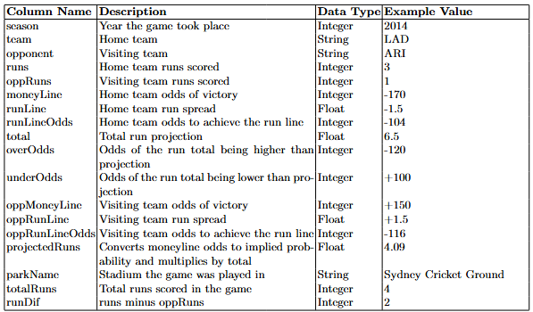
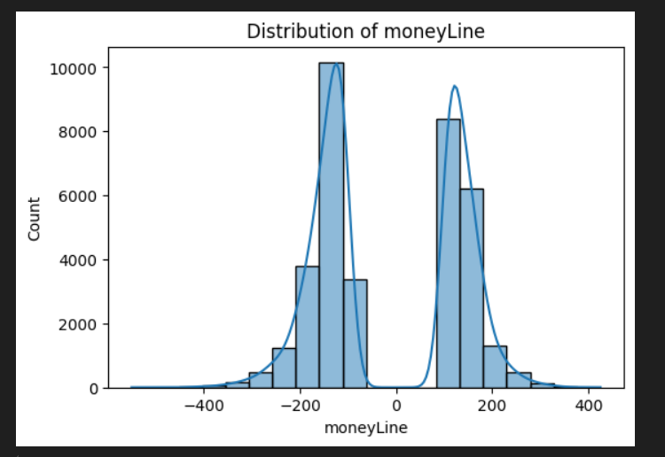
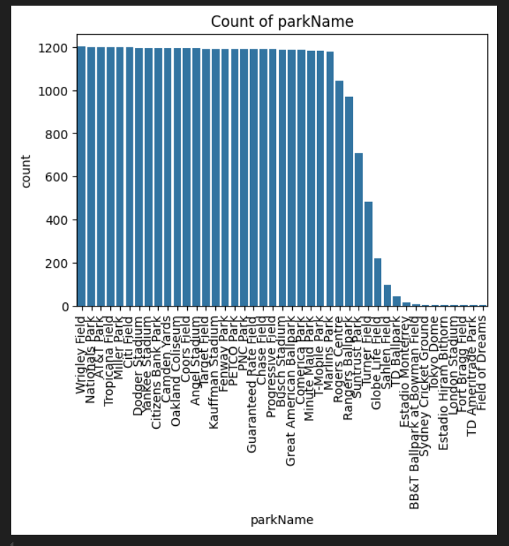
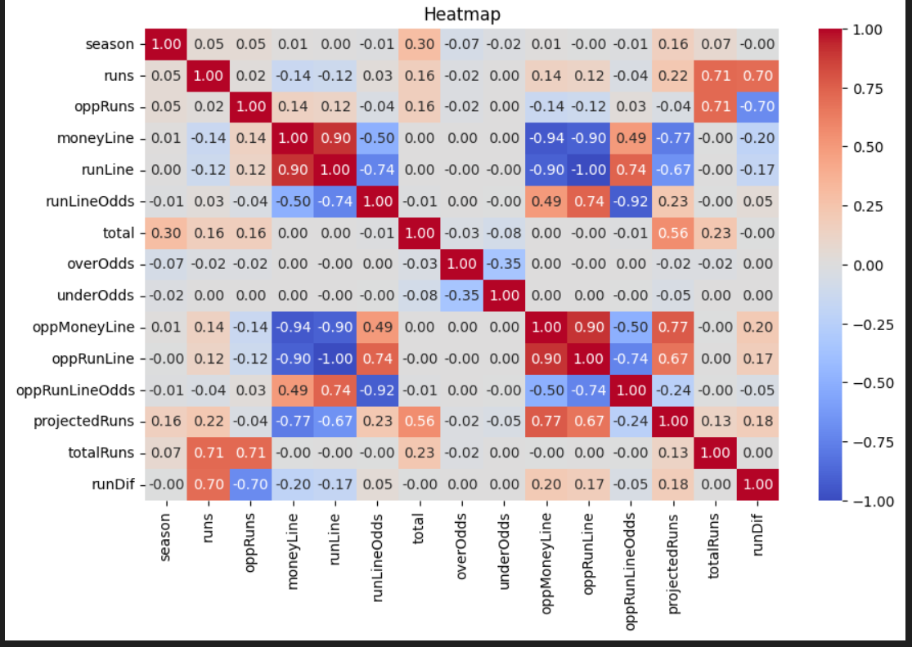
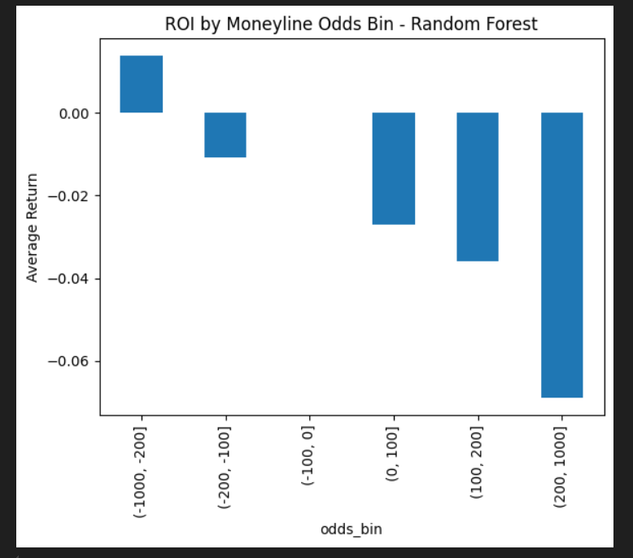
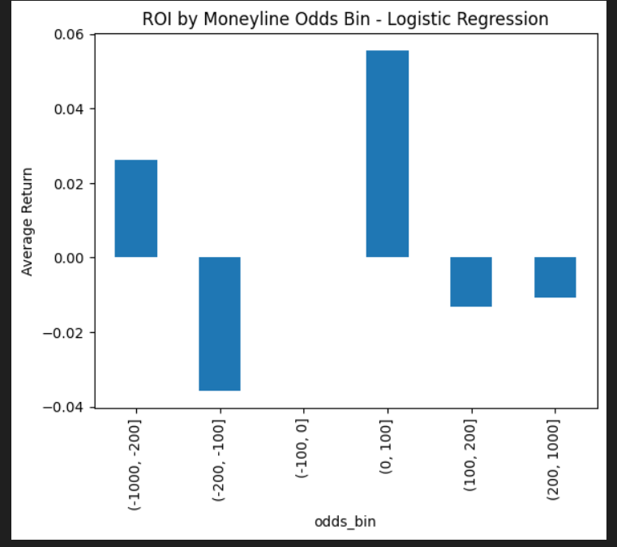
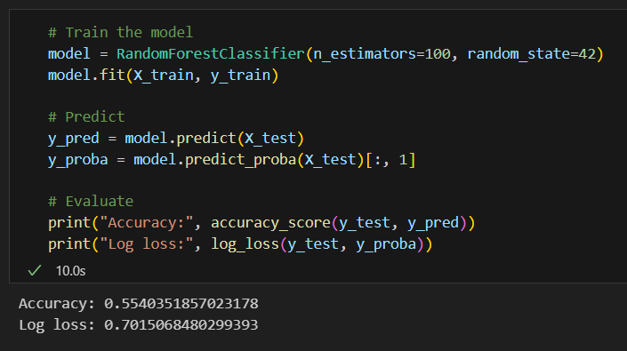
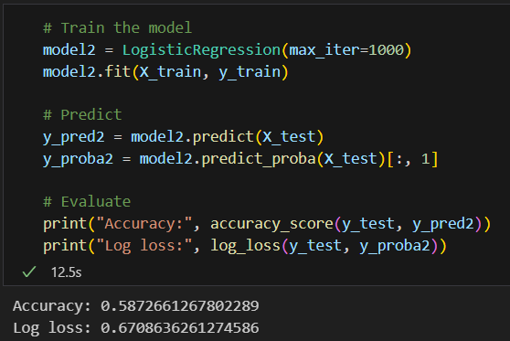

# Rueckert_Capstone_Project

Author: Trent Rueckert
Date: 7/14/2025
Overleaf Report: https://www.overleaf.com/read/kyhvrbyvqmts#dffb56

## Project Setup
### Create and Activate Virtual Environment
Before running the scripts, set up a virtual environment:
```powershell
# Create virtual environment
py -m venv .venv

# Activate virtual environment (Windows)
venv\Scripts\activate
```

### Install Required Dependencies
Ensure all necessary libraries are installed:
```powershell
py -m pip install --upgrade pip setuptools wheel
py -m pip install --upgrade -r requirements.txt
```

## Overview
The goal of this project is to predict the winners of Major League Baseball games and, in addition, to generate a profit through betting. This will be achieved through preparing/exploring the data, cleaning the data/handling missing values, performing feature engineering, and training machine learning models based on different selected features. More specifically Random Forest and Logistic Regression models to provide insights on all of the features' collective impact on predicting the winner of MLB games.

## Report Structure
### Section 1. Introduction
* 1.1 Data Source and Contents
* 1.2 Project Workflow and Results
* 1.3 Project Limitations
* 1.4 Project Links

### Section 2. Data Preperation and Exploration
* 2.1 Data Source
* 2.2 Data Format
* 2.3 Data Extraction and Ingestion
* 2.4 Data Dictionary
* 2.5 Other Collection Details

### Section 3. Data Cleaning and Curation Process
* 3.1 Data Collection and Cleaning
* 3.2 Tools and Techniques
* 3.3 Missing Values Strategy
* 3.4 Cleaned Dataset Information
* 3.5 Attribute Definitions
* 3.6 Relevance and Variables

### Section 4. Exploratory Data Analysis (EDA)
* 4.1 Process and Resources
* 4.2 Step 1. Install Dependencies
* 4.3 Step 2. Load the Data and Describe
* 4.4 Step 3. Missing/Null and Duplicates
* 4.5 Step 4. Numerical Column Distribution
* 4.6 Step 5. Categorical Column Distribution
* 4.7 Step 6. Bivariate Analysis
* 4.8 Discussion

### Section 5. Predictive Analysis and Insights
* 5.1 Overview
* 5.2 Process
* 5.3 Model Training
* 5.4 Implementation
* 5.5 Results and Insights
* 5.6 Discussion

### Section 6. Limitations and Future Work
* 6.1 Limitations
* 6.2 Future Work

### Section 7. Conclusion

### References

## Dataset
The data was retrieved from [Kaggle](https://www.kaggle.com/datasets/christophertreasure/major-league-baseball-vegas-data?select=oddsDataMLB.csv). It consists of a mix of betting lines, odds, and some game statistics from the 2014-2021 Major League Baseball seasons. 

Below is the data dictionary of the dataset:



## Visualizations
### Exploratory Data Analysis (EDA)






### Results









## Results
* Random Forest:
  * Accuracy score of 55.40% 
  * Log loss of 0.7015
  * AUC of 58%
* Logistic Regression:
  * Accuracy score of 58.73%
  * Log loss of 0.6709
  * AUC of 62%
* Neither one provided good enough results to be used for betting.

## Limitations and Future Work
* Limitations:
  * Lack of lineup data and starting pitchers
  * Outdated data
* Future Work:
  * Up-To-Date Data
  * Feature Importance Analysis
  * Pitcher and Lineup Inclusion
  * Choose Better Models

## Conclusion
The models of this project failed to accomplish the goal of accurately predicting the winner of MLB games based on betting odds and lines, and thus should not be used for making a profit betting on games. The models performed well with heavy favorites (which was expected) but very poorly overall with underdogs. Both models also performed poorly with slight favorites, which was a big sign that the models themselves were not effective at predicting winners. On the bright side, it was found that home teams win more games and by bigger margins than visiting teams, indicating a home field advantage.